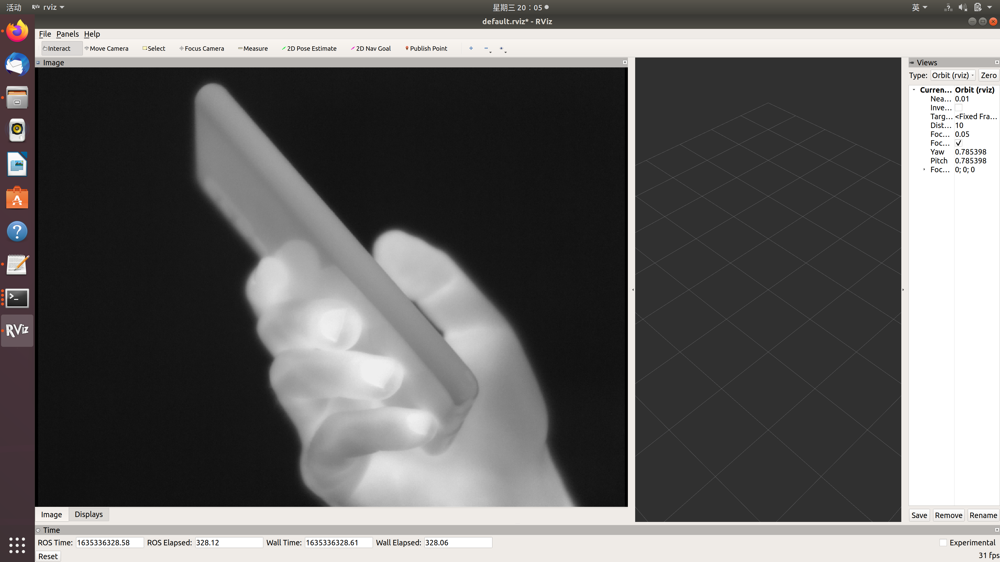
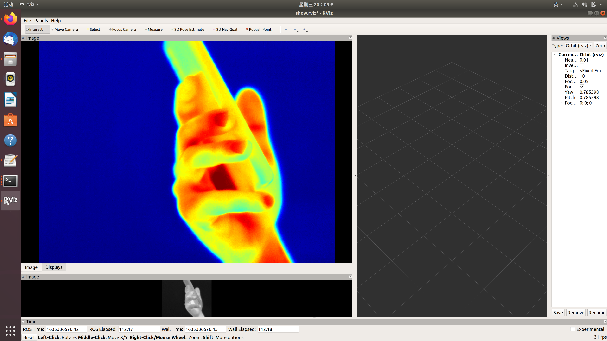

# FLIR-thermal-image-ROS
## 一、介绍
本仓库ROS包对FLIR A615相机(USB3 vision)进行订阅(topic: /usb_cam/image_raw)，进行伪彩色增强后发布(topic: /thermal/pseudo_color)，工作空间目录如下所示。
```
ws_FLIR
│   README.md
│   
└───src
     │
     └───package: ir_convert
                              node: ir_convert_node (subscribe FLIR camera raw image and convert)
                                │                        
                                └─   launch file: ir_convert.launch(launch ir_convert_node)
```

调试环境与依赖：
* Ubuntu 18.04 ROS melodic
* `usb_cam`包 
* OpenCV 3.2.0
* Hardware: FLIR A615 (USB connection)

## 二、使用方法
1. 安装ROS
2. 安装`usb_cam`包<sup>[1]</sup>，把resources/usb_flir.launch文件放在usb_cam的launch文件夹下
3. 安装本仓库
```
mkdir -p ~/xxx/src
cd ~/xxx/src
catkin_init_workspace
git clone https://github.com/GCaptainNemo/fusion-lidar-camera-ROS.git
mv ./ FLIR-thermal-camera-ROS/src/ir_convert  ./
mv ./ FLIR-thermal-camera-ROS/src/launch_file  ./
cd ..
catkin_make

```
4. 运行usb-cam包
```
roslaunch usb_cam usb_flir.launch
```

或者下载ROS-bag原始红外图像测试数据地址

链接: https://pan.baidu.com/s/1MUsm2CswUyRHH7sWTro-pg 提取码: h77t 

5. 运行ir_convert_node数据转换节点，并在rviz中显示
```roslaunch ir_convert  ir_convert.launch``` 

## 三、效果

<p align="center"></p>
<h6 align="center"> 原始红外图像</h6>

<p align="center"></p>
<h6 align="center"> 为彩色增强图像</h6>

## 四、参考资料

[1] [usb-cam安装](https://www.jianshu.com/p/ec0ebf7fef22)

[2] [raw2temp](https://www.rdocumentation.org/packages/Thermimage/versions/4.0.1/topics/raw2temp)

[3] [获得FLIR exif元信息](https://github.com/Nervengift/read_thermal.py)


